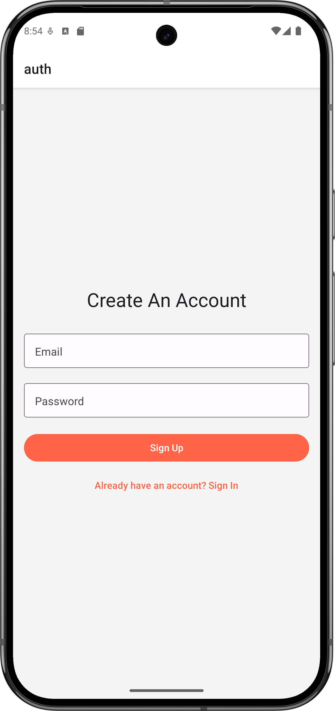
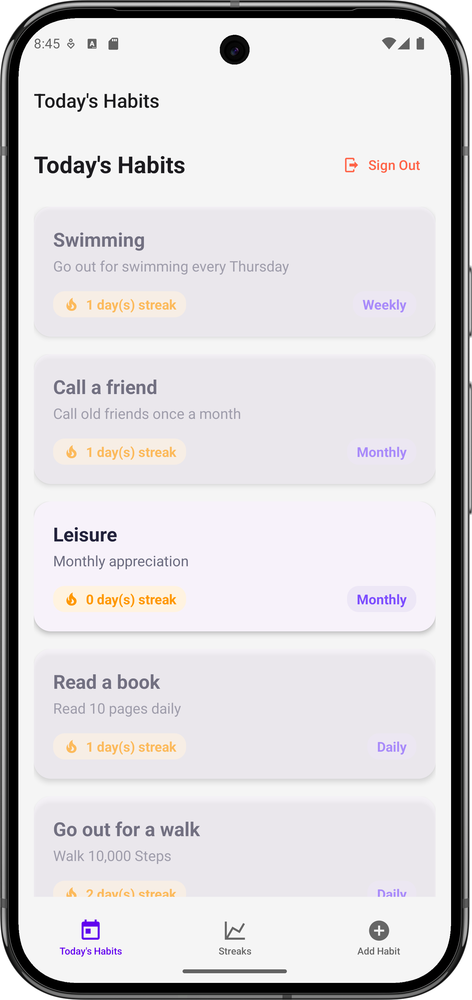
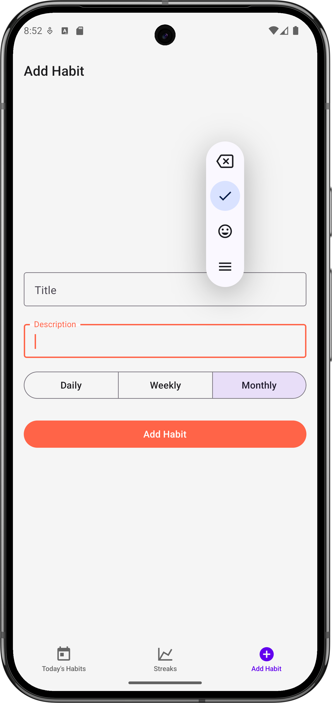
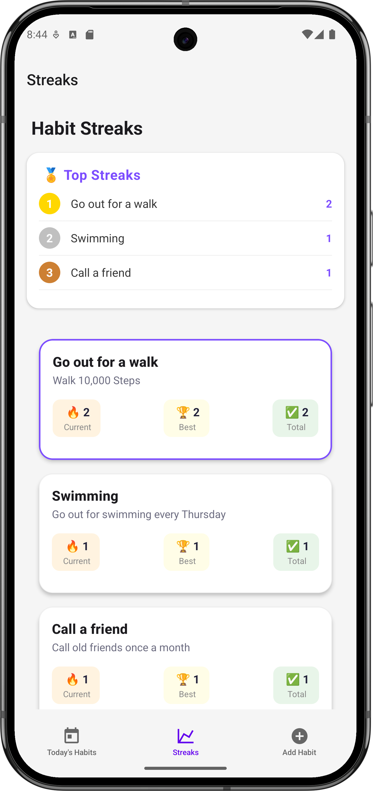

# 🧠 HabitTracker

A sleek and simple React Native habit tracking app to help users build consistent habits, track progress, and view streaks — all with a clean UI and smooth experience.

---

## ✨ Features

- 🔐 **Authentication** – Sign up and log in securely.
- 📝 **Add Habits** – Create custom daily habits to track.
- 📅 **Track Progress** – Mark habits as completed.
- 🔥 **View Streaks** – See how consistent you've been.
- 🎯 **Responsive UI** – Clean and modern interface for a great UX.

---

## 📸 Screenshots

| Auth Screen                                        | Habit List                                             | Add Habit                                               | Streaks                                             |
|----------------------------------------------------|--------------------------------------------------------|---------------------------------------------------------|-----------------------------------------------------|
|  |  |  |  |

> Replace the paths above with actual paths to your screenshot images

---

## 🚀 Getting Started

### Prerequisites

- Node.js >= 14
- Expo CLI (`npm install -g expo-cli`)
- Git

### Installation

```bash
git clone https://github.com/yourusername/habit-tracker-app.git
cd habit-tracker-app
npm install
expo start
```


## ⚙️ Technologies Used

- **React Native**
- **React Native Paper** (for styling)
- **Expo**
- **Expo Router** (for navigation)
- **Appwrite Auth** (for authentication)
- **Appwrite Databases** (for storage)
- **TypeScript**
